# Customer Journey Visual Maps

## Journey 1: Standard Complaint Flow


## Journey 2: Service Request Flow


## Journey 3: Escalation Path with Touchpoints

```mermaid
graph TB
    Start([Case Created<br/>Status: New]) --> Ack[Acknowledgment Sent<br/>Status: Acknowledged<br/>⏱️ Within 24h]
    
    Ack --> Assign[Auto-Assigned<br/>Status: In Progress]
    
    Assign --> Process{Handler<br/>Takes Action?}
    
    Process -->|Yes| Investigate[Investigation<br/>Status: Investigation]
    Process -->|No Response| Warning1[⚠️ Warning Email<br/>SLA - 8 hours]
    
    Warning1 --> Process
    
    Investigate --> ResCheck{Resolution<br/>Proposed?}
    
    ResCheck -->|Yes| PendCust[Pending Customer<br/>Wait 48h for response]
    ResCheck -->|No| SLACheck{SLA<br/>Breached?}
    
    SLACheck -->|Yes| Escalate1[🔺 Auto-Escalate<br/>Level: Supervisor<br/>Status: Escalated]
    SLACheck -->|No| Investigate
    
    Escalate1 --> Sup[Supervisor Reviews]
    
    Sup --> SupResolve{Resolved?}
    
    SupResolve -->|Yes| Resolved
    SupResolve -->|No,24h+| Escalate2[🔺🔺 Escalate to Manager<br/>Level: Manager]
    
    Escalate2 --> MgrResolve{Manager<br/>Resolves?}
    
    MgrResolve -->|Yes| Resolved
    MgrResolve -->|No| Escalate3[🔺🔺🔺 Senior Management<br/>Level: Senior Management]
    
    PendCust --> CustResp{Customer<br/>Responds?}
    
    CustResp -->|Accepts| Resolved[Status: Resolved<br/>⏱️ Record resolution time]
    CustResp -->|Rejects| Investigate
    CustResp -->|No Response 7d| AutoClose
    
    Resolved --> Wait[⏱️ Wait 24 hours]
    
    Wait --> Survey[📧 Send Satisfaction Survey]
    
    Survey --> Wait2[⏱️ Wait 7 days]
    
    Wait2 --> AutoClose[Status: Closed<br/>✅ Journey Complete]
    
    AutoClose --> End([End])
    
    Escalate3 --> Resolved
    
    style Start fill:#3498db,stroke:#2c3e50,color:#fff
    style Ack fill:#9b59b6,stroke:#2c3e50,color:#fff
    style Escalate1 fill:#e74c3c,stroke:#2c3e50,color:#fff
    style Escalate2 fill:#c0392b,stroke:#2c3e50,color:#fff
    style Escalate3 fill:#8b0000,stroke:#2c3e50,color:#fff
    style Resolved fill:#27ae60,stroke:#2c3e50,color:#fff
    style AutoClose fill:#2c3e50,stroke:#2c3e50,color:#fff
```



## Journey 4: High-Value / Regulatory Complaint


## Journey 5: Multi-Channel Case Creation

```mermaid
flowchart TD
    Start([Customer Has Issue]) --> Channel{Choose<br/>Channel}
    
    Channel -->|Self-Service| Portal[Customer Portal]
    Channel -->|Assistance| Phone[Call Center]
    Channel -->|Physical| Branch[Branch Visit]
    Channel -->|Written| Email[Email]
    
    Portal --> PortalForm[Fill Online Form]
    Phone --> CallAgent[Speak to Agent]
    Branch --> BranchOfficer[Meet Officer]
    Email --> EmailInbox[Send to support@]
    
    PortalForm --> PortalSubmit[Submit + Attach Docs]
    CallAgent --> CallLog[Agent Logs Case]
    BranchOfficer --> BranchLog[Officer Creates Case]
    EmailInbox --> EmailToCase[Email-to-Case]
    
    PortalSubmit --> CaseCreated[Case Created in CRM]
    CallLog --> CaseCreated
    BranchLog --> CaseCreated
    EmailToCase --> CaseCreated
    
    CaseCreated --> AutoProcess[🤖 Auto-Processing]
    
    AutoProcess --> Step1[Generate Case Number]
    Step1 --> Step2[Calculate SLA Dates]
    Step2 --> Step3[Auto-Assign Handler]
    Step3 --> Step4[Send Acknowledgment]
    
    Step4 --> Multi[Multi-Channel Response]
    
    Multi --> SMS[📱 SMS to Customer]
    Multi --> EmailConf[📧 Email with Details]
    Multi --> PortalUpdate[🖥️ Portal Notification]
    
    SMS --> Unified[Unified Journey Continues...]
    EmailConf --> Unified
    PortalUpdate --> Unified
    
    Unified --> End([Case Processing Workflow])
    
    style Portal fill:#3498db,color:#fff
    style Phone fill:#e67e22,color:#fff
    style Branch fill:#27ae60,color:#fff
    style Email fill:#9b59b6,color:#fff
    style CaseCreated fill:#2c3e50,color:#fff
    style AutoProcess fill:#f39c12,color:#fff
```



## Journey 6: Portal User Experience

```mermaid
graph LR
    subgraph "Customer Portal Experience"
        Login[🔐 Login] --> Dashboard[📊 My Dashboard]
        
        Dashboard --> MyCase[My Cases<br/>List View]
        Dashboard --> NewCase[➕ Submit New Case]
        Dashboard --> FAQ[📚 FAQ /<br/>Knowledge Base]
        
        MyCase --> Filter[Filter/Sort<br/>By Status/Category]
        MyCase --> CaseDetail[📄 Case Details]
        
        CaseDetail --> Timeline[📅 Case Timeline<br/>All Updates]
        CaseDetail --> Upload[📎 Upload<br/>Documents]
        CaseDetail --> Comment[💬 Add Comments]
        CaseDetail --> Status[📊 Track SLA Status]
        
        NewCase --> Form[Complaint Form]
        Form --> Category[Select Category]
        Category --> Product[Select Product]
        Product --> Describe[Describe Issue]
        Describe --> Attach[Attach Files]
        Attach --> Submit[✅ Submit]
        
        Submit --> Confirm[Confirmation Page<br/>Case Number Generated]
        Confirm --> Email[📧 Email Sent]
        Confirm --> SMS[📱 SMS Sent]
        
        Timeline --> Survey{Case<br/>Resolved?}
        Survey -->|Yes| Rating[⭐ Rate Experience<br/>1-5 Stars]
        Survey -->|No| Reopen[🔄 Reopen Case]
        
        Rating --> Thanks[Thank You Message]
        
        FAQ --> Search[🔍 Search Articles]
        Search --> Article[View Help Article]
        Article --> Helpful{Was This<br/>Helpful?}
        Helpful -->|No| NewCase
        Helpful -->|Yes| Dashboard
    end
    
    style Login fill:#3498db,color:#fff
    style Dashboard fill:#27ae60,color:#fff
    style Submit fill:#e67e22,color:#fff
    style Rating fill:#f39c12,color:#fff
    style Confirm fill:#9b59b6,color:#fff
```



## Journey 7: Internal Handler Experience

```mermaid
stateDiagram-v2
    [*] --> NewAssignment: Case assigned
    
    NewAssignment --> Review: Review case details
    
    Review --> CheckInfo: Check completeness
    
    CheckInfo --> Sufficient: Info complete
    CheckInfo --> RequestMore: Missing info
    
    RequestMore --> WaitCustomer: Wait for customer
    WaitCustomer --> Sufficient: Info received
    
    Sufficient --> Investigate: Start investigation
    
    Investigate --> CheckLoan: Check loan system
    Investigate --> CheckHistory: Review history
    Investigate --> ConsultTeam: Consult team/manager
    
    CheckLoan --> Analysis
    CheckHistory --> Analysis
    ConsultTeam --> Analysis
    
    Analysis --> RootCause: Identify root cause
    
    RootCause --> PrepareResolution: Prepare solution
    
    PrepareResolution --> NeedsApproval: Resolution needs approval?
    
    NeedsApproval --> ManagerTask: Create approval task
    NeedsApproval --> Propose: Direct resolution
    
    ManagerTask --> WaitApproval: Wait for manager
    WaitApproval --> Approved: Approved
    WaitApproval --> Rejected: Need revision
    
    Rejected --> PrepareResolution
    
    Approved --> Propose
    Propose --> SendResolution: Email customer
    
    SendResolution --> WaitResponse: Wait 48 hours
    
    WaitResponse --> Accepted: Customer accepts
    WaitResponse --> Declined: Customer declines
    WaitResponse --> NoResponse: Timeout
    
    Accepted --> ProcessAction: Process compensation/<br/>waiver/refund
    
    ProcessAction --> MarkResolved: Update status:<br/>Resolved
    
    MarkResolved --> Document: Document case
    
    Document --> [*]
    
    Declined --> PrepareResolution: Revise solution
    
    NoResponse --> FollowUp: Follow-up call/email
    FollowUp --> WaitResponse
    
    note right of NewAssignment
        📧 Email notification
        📱 SMS if urgent
        🔔 Portal notification
    end note
    
    note right of WaitCustomer
        ⏱️ SLA clock paused
        Status: Pending Customer
    end note
    
    note right of ProcessAction
        💰 Financial transactions
        📝 Accounting entries
        🔐 Manager authorization
    end note
```



## Touchpoint Summary Matrix

| Stage | Customer Touchpoint | System Action | Handler Touchpoint | Timeline |
|-------|-------------------|---------------|-------------------|----------|
| **Submission** | Portal/Email/Phone/Branch | Case created, number generated | - | Instant |
| **Acknowledgment** | SMS + Email received | Calculate SLA, auto-assign | Email notification | < 24h |
| **Assignment** | Portal shows "In Progress" | Round-robin assignment | Task created | < 24h |
| **Investigation** | Email: "Request for docs" | Status: Investigation | Review documents | Variable |
| **Pending** | Portal shows waiting status | SLA clock paused | Awaiting customer | 2-7 days |
| **Resolution** | Email with proposal | - | Manager approval if needed | By SLA date |
| **Acceptance** | Portal: Accept/Reject | Process compensation | Execute actions | 48h window |
| **Closure** | Email: Satisfaction survey | Auto-close after 7d | - | +7 days |
| **Post-Closure** | Survey completed | Record rating | Analytics update | +30 days |

---

## SLA Timeline Visualization

```
New Case Created (T+0h)
│
├─ Acknowledgment Due (T+24h) ───────────────┐
│                                             │
├─ First Response (T+48h) ────────────────┐  │
│                                          │  │
├─ Investigation Updates (T+72h) ───────┐ │  │
│                                        │ │  │
├─ SLA Warning (Resolution-8h) ───────┐ │ │  │
│                                      │ │ │  │
├─ Resolution Due ────────────────────┼─┼─┼──┼─ ⚠️ DEADLINE
│   (T+48h to T+168h based on type)  │ │ │  │
│                                      │ │ │  │
├─ Customer Response (48h window) ────┼─┼─┘  │
│                                      │ │    │
├─ Case Resolved (variable) ──────────┼─┘    │
│                                      │      │
├─ Survey Sent (Resolved+24h) ────────┘      │
│                                             │
└─ Auto-Close (Resolved+7d) ─────────────────┘

Legend:
─── Normal flow
━━━ Critical path
⚠️  Escalation point
✓  Success milestone
```
